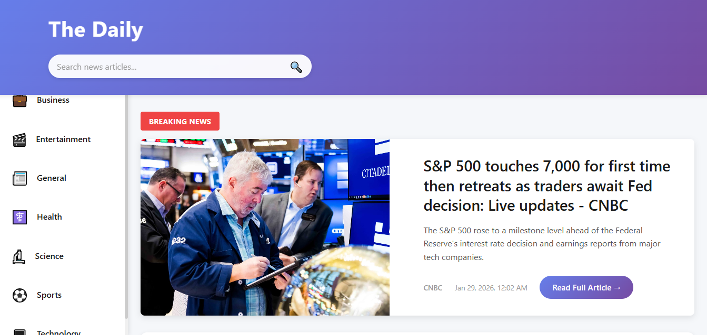
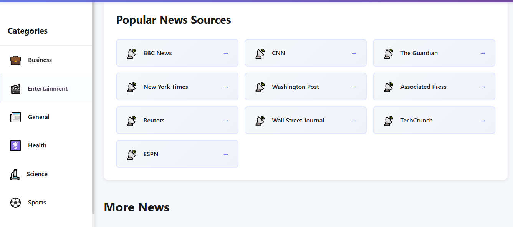
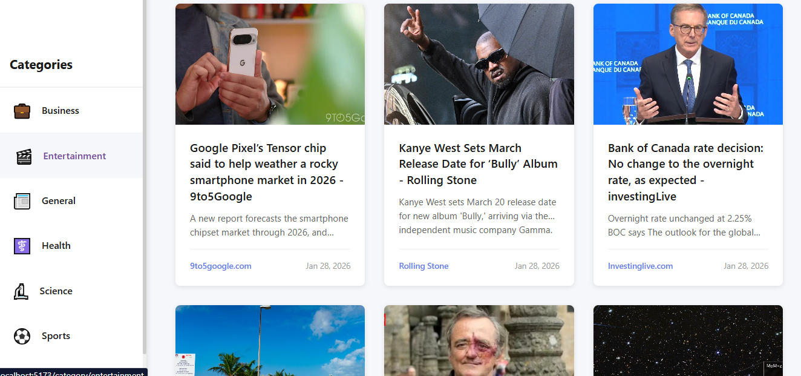
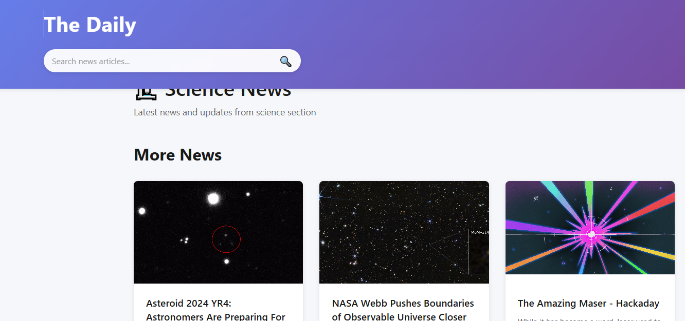

# React News App 📰

A modern **news reading web application** built using **React** that fetches real-time news articles from **NewsAPI.org**.  
The app allows users to explore news based on **categories, sources, agencies, and topics**, along with **top headlines** from various publishers.

---

## 🚀 Features

- 🗞️ Top headlines from multiple news agencies
- 🧭 Category-wise news (Business, Sports, Technology, Health, etc.)
- 🏢 News by sources & publishers
- 🔍 Topic-based article filtering
- 🌍 Country-specific news
- 📄 Detailed article view
- 🔄 Real-time data fetching from NewsAPI
- 📱 Responsive design for web devices

---

## 📸 Screenshots

| | |
|---|---|
|  |  |
|  |  |
|  | |


---

## 🛠️ Tech Stack

### Frontend
- React
- JavaScript (ES6+)
- HTML5, CSS3
- Axios / Fetch API
- React Router

### API
- [NewsAPI.org](https://newsapi.org)

---

## 📂 Project Structure

```bash
react-news-app/
├── src/
│   ├── components/
│   ├── pages/
│   ├── services/
│   ├── hooks/
│   ├── utils/
│   ├── App.js
│   └── main.jsx
│
├── screenshots/
│   ├── na1.PNG
│   ├── na2.PNG
│   ├── na3.PNG
│   ├── na4.PNG
│   └── na5.PNG
│
├── public/
├── .env
├── package.json
└── README.md
